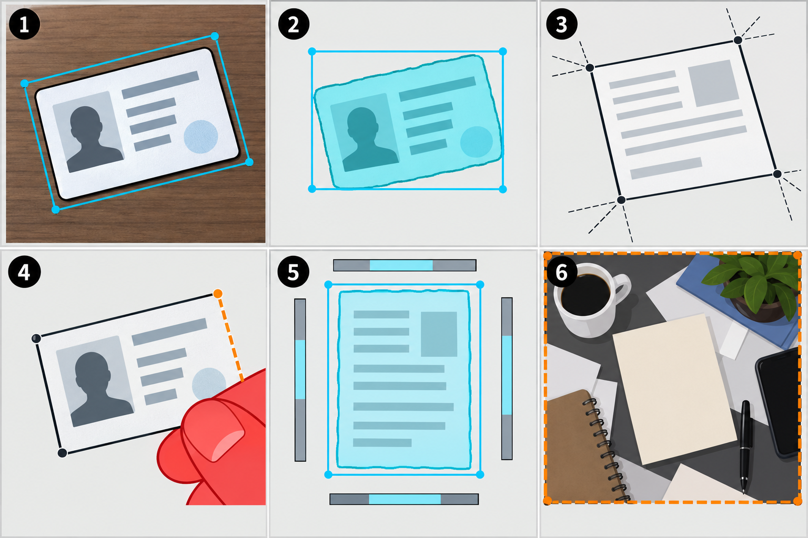

# Luồng xử lý của AI Engine

Tài liệu này mô tả luồng thực tế của `ai-engine` hiện tại. Điểm vào HTTP là `ai-engine/app.py`; pipeline xử lý ảnh là `ai-engine/pipeline.py`.

## Tổng quan

```text
POST /preprocess
    │
    ├─ Kiểm tra file và tạo file tạm riêng cho job
    ├─ Khóa xử lý tuần tự
    ├─ pipeline.py
    │   ├─ 1. Phân loại hướng xoay 0/90/180/270°, xoay nếu cần
    │   ├─ 2. Xác định bốn góc và perspective crop
    │   ├─ 3. Deskew
    │   ├─ 4. Khử chói
    │   ├─ 5. Khử mờ
    │   └─ 6. Resize và tăng tương phản
    ├─ Trả `document_final.jpg` dưới dạng JPEG
    └─ Xóa file tạm sau khi response hoàn thành
```

Pipeline **không dùng UVDoc**. Sau bước crop, ảnh đi thẳng đến deskew.

> Lưu ý về file cũ: `output/orientation_corrected_res.jpg` được tạo bởi `test_unwarping.py` khi chạy UVDoc thủ công. Script này không được `pipeline.py` gọi, không phải output của bước chỉnh chiều trong luồng đang hoạt động, và tên file có thể gây nhầm lẫn. Output thực tế của bước 1 là `output/orientation_corrected.jpg`.

## API FastAPI

### Kiểm tra trạng thái

```http
GET /health
```

Phản hồi thành công:

```json
{
  "status": "ok",
  "service": "document-image-ai-engine"
}
```

### Xử lý ảnh

```http
POST /preprocess
Content-Type: multipart/form-data

file: <ảnh đầu vào>
```

- Chỉ nhận phần mở rộng `.jpg`, `.jpeg`, `.png`, `.webp`.
- Thành công trả về file JPEG (`Content-Type: image/jpeg`).
- File input và file response tạm có mã UUID riêng trong `ai-engine/tmp/`.
- Pipeline chạy tối đa 300 giây. Quá thời gian trả HTTP `504`.
- Nếu một script pipeline lỗi, API trả HTTP `500` với phần lỗi cuối cùng.

## Vì sao chỉ xử lý một ảnh tại một thời điểm?

Các ảnh trung gian của pipeline có tên cố định trong `ai-engine/output/`, ví dụ `document_crop.jpg` và `document_final.jpg`. Vì vậy `app.py` dùng `asyncio.Lock()` để không cho hai pipeline ghi đè output của nhau. Request sau sẽ chờ request trước hoàn tất.

## Chi tiết từng bước pipeline

### 1. Phân loại hướng xoay 90° và xoay có điều kiện

**Script:** `test_orientation_rotate.py`  
**Input:** ảnh do API ghi vào thư mục tạm  
**Output:** `output/orientation_corrected.jpg`

PaddleOCR `DocImgOrientationClassification` với model `PP-LCNet_x1_0_doc_ori` dự đoán nhãn `0`, `90`, `180` hoặc `270`. Đây là bước sửa **hướng xoay lớn của toàn bộ ảnh** (ví dụ ảnh điện thoại bị quay ngang hoặc lộn ngược), không phải bước nắn thẳng giấy tờ đang đặt xéo trong khung hình. Script **luôn ghi** file `orientation_corrected.jpg`, nhưng chỉ thực hiện phép xoay hình học khi nhãn khác `0`:

| Nhãn | Thao tác |
| --- | --- |
| `0` | Không xoay |
| `90` | Xoay ngược chiều kim đồng hồ 90° |
| `180` | Xoay 180° |
| `270` | Xoay theo chiều kim đồng hồ 90° |

Do đó, khi model trả nhãn `0`, `orientation_corrected.jpg` trông giống ảnh đầu vào: ảnh chưa bị xoay, chưa crop và chưa bị deskew. Ví dụ CCCD trong ảnh vẫn có thể nằm xéo so với mép ảnh. File này chỉ là đầu ra chuẩn hóa chiều để bước crop luôn đọc từ một đường dẫn cố định. Khi model trả `90`, `180` hoặc `270`, file này mới là ảnh đã được xoay về chiều đọc đúng.

Góc nghiêng nhỏ của giấy tờ chỉ được ước lượng sau khi crop, ở bước 3 `document_deskew.jpg`, bằng các đường thẳng Hough. Vì vậy không dùng `orientation_corrected.jpg` để đánh giá kết quả deskew hoặc nắn phối cảnh.

### 2. Xác định bốn góc và perspective crop

**Script:** `test_document_crop.py`  
**Input:** `output/orientation_corrected.jpg`  
**Output chính:** `output/document_crop.jpg`

Script thu nhỏ ảnh về cạnh dài tối đa 1200 px để nhận diện nhanh, sau đó quy đổi bốn góc về kích thước ảnh gốc. Bốn góc luôn được sắp theo thứ tự:

```text
P1: trên-trái     P2: trên-phải
P4: dưới-trái     P3: dưới-phải
```

#### Mô hình sử dụng

Bước này **không dùng model AI/ML riêng để phát hiện giấy tờ hoặc 4 góc**: không có YOLO, OCR detector hay segmentation model. `test_document_crop.py` dùng các thuật toán OpenCV cổ điển kết hợp luật hình học. Model PaddleOCR chỉ xuất hiện ở bước 1 để phân loại hướng xoay toàn ảnh, không tham gia xác định bốn góc.

#### Cơ chế tìm bốn góc

Trước khi detect, ảnh được thu nhỏ sao cho cạnh dài tối đa 1200 px để giảm chi phí xử lý. Sau khi có bốn điểm, tọa độ được chia ngược theo scale để quay lại ảnh gốc.

**Nhánh chính — biên và contour:**

1. Chuyển ảnh sang grayscale, Gaussian blur, Canny edge (`40/120`), rồi morphology close để nối các cạnh giấy tờ bị đứt.
2. Tìm contour; mỗi contour được `approxPolyDP` xấp xỉ bằng đa giác với epsilon bằng 2% chu vi.
3. Chỉ giữ đa giác lồi có đúng 4 đỉnh.
4. Sắp bốn điểm thành trên-trái, trên-phải, dưới-phải, dưới-trái.

**Bộ lọc và chấm điểm ứng viên:**

Một tứ giác chỉ được nhận nếu thỏa các điều kiện chính sau:

| Tiêu chí | Quy tắc hiện tại |
| --- | --- |
| Diện tích | Từ 8% đến 95% diện tích ảnh detect |
| Tỷ lệ dài/rộng | Từ 1,35 đến 2,20 |
| Độ lấp đầy hình chữ nhật | Contour phải đạt tối thiểu 0,45 diện tích `minAreaRect` |
| Hai cạnh đối diện | Độ tương đồng chiều dài mỗi cặp tối thiểu 0,60 |
| Góc | Sai số góc trung bình so với 90° không quá 35° |
| Mép khung hình | Ứng viên sát biên bị giảm điểm |

Điểm cuối là tổ hợp của tỷ lệ diện tích, độ chữ nhật, độ tương đồng hai cặp cạnh, độ gần tỷ lệ CCCD tham chiếu 1,586 và độ vuông góc. Ứng viên có điểm lớn nhất được chọn. Các ngưỡng này chỉ là luật ưu tiên để phân biệt giấy tờ với các hình chữ nhật khác; chúng không cố định theo một file ảnh đầu vào.

**Nhánh theo màu và ROI:**

Nếu nhánh cạnh không tìm được tứ giác tin cậy, hệ thống tạo mask HSV cho vùng xanh/xanh xám thường thấy trên CCCD, tìm contour tứ giác từ mask. Nếu chỉ tìm được vùng màu thô, nó mở rộng vùng đó thành ROI rồi chạy lại detector cạnh trong ROI. Có một mask màu ấm riêng cho giấy tờ vàng/be như giấy phép lái xe; nhánh này tách riêng để không làm thay đổi cách nhận diện CCCD xanh.

**Fallback hình học:**

Khi contour không đủ 4 cạnh rõ ràng, các fallback chạy theo thứ tự:



Hình là minh họa cơ chế, không phải kết quả detection của một ảnh người dùng cụ thể. Số trong từng khung tương ứng với fallback dưới đây:

1. **`minAreaRect` từ cạnh ngoài hoặc mask màu.** Ví dụ khung 1: viền thẻ bị nghiêng nhưng còn đủ vùng biên/màu, nên hình chữ nhật xoay màu cyan bao quanh thẻ được dùng làm bốn góc.
2. **Hộp bao HSV thô.** Ví dụ khung 2: mask chỉ thấy vùng màu xanh của thẻ và không thấy đúng viền; hệ thống dùng hộp bao cyan rồi chỉ chấp nhận nếu tỷ lệ, diện tích và vị trí trong ảnh hợp lệ.
3. **Ghép đường phối cảnh bằng Hough Lines.** Ví dụ khung 3: bốn cạnh hiện thành các đường thẳng xéo; giao điểm giữa chúng tạo ra bốn góc của giấy tờ.
4. **Khôi phục từ ba cạnh khi bị che.** Ví dụ khung 4: bàn tay che mất cạnh phải/dưới; detector lấy một cạnh ngang cùng hai cạnh bên còn thấy, suy ra cạnh thiếu theo các tỷ lệ giấy tờ hợp lệ, rồi kiểm tra mức độ cạnh thật dọc chu vi dự đoán.
5. **Tách giấy tờ khỏi nền đồng nhất.** Ví dụ khung 5: bốn dải biên ảnh dùng để ước lượng màu nền trong LAB; vùng có khoảng cách màu lớn hơn nền thành mask cyan và được kiểm tra lại theo hình chữ nhật.
6. **Fallback toàn ảnh an toàn.** Ví dụ khung 6: cảnh có nhiều vật thể khiến không có ứng viên đủ tin cậy; toàn khung ảnh được giữ lại thay vì crop nhầm làm mất nội dung giấy tờ.

#### Từ bốn góc đến ảnh crop

Sau khi chọn được khung, bốn góc được nới ra từ tâm 3% để tránh cắt sát mép; một số fallback HSV dùng 10% vì mask màu có thể bỏ sót viền nhựa trong hoặc vùng sáng. `cv2.getPerspectiveTransform` tạo ma trận homography và `cv2.warpPerspective` biến đổi tứ giác thành ảnh chữ nhật phẳng. Đây là bước vừa crop vừa nắn phối cảnh; kết quả là `document_crop.jpg`.

Ảnh phục vụ kiểm tra bước này:

| File | Mục đích |
| --- | --- |
| `output/document_detection.jpg` | Vẽ bốn góc tìm được trên ảnh gốc |
| `output/document_mask.jpg` | Mask/cạnh của phương án thắng |
| `output/document_crop.jpg` | Ảnh đã crop và chỉnh phối cảnh |

### 3. Deskew

**Script:** `test_deskew.py`  
**Input:** `output/document_crop.jpg`  
**Output:** `output/document_deskew.jpg`

Script chuyển xám, Gaussian blur, Canny rồi dùng `HoughLinesP` để lấy các đường gần ngang (góc không quá 15°). Trung vị của các góc này là góc nghiêng. Nếu độ nghiêng dưới 0,3° thì giữ nguyên ảnh; nếu lớn hơn, script xoay ngược góc đó bằng nội suy cubic, đồng thời mở rộng canvas và dùng `BORDER_REPLICATE` để hạn chế mất mép.

### 4. Khử chói

**Script:** `test_glare.py`  
**Input:** `output/document_deskew.jpg`  
**Output chính:** `output/document_deglare.jpg`

Vùng chói được nhận diện trong không gian HSV: giá trị sáng cao, độ bão hòa thấp. Mask được đóng morphology và lọc connected components quá nhỏ, chạm biên, quá mảnh hoặc thưa. Ở các pixel thuộc mask, kênh sáng `L` trong LAB được giảm còn 82%, sau đó chuyển về BGR.

Ảnh kiểm tra:

| File | Mục đích |
| --- | --- |
| `output/glare_mask.jpg` | Mask vùng chói |
| `output/glare_detection.jpg` | Khung đỏ minh họa vùng chói |

### 5. Khử mờ

**Script:** `test_deblur.py`  
**Input:** `output/document_deglare.jpg`  
**Output:** `output/document_deblur.jpg`

Độ mờ được đo bằng phương sai Laplacian. Script chọn mức Unsharp Mask theo điểm số:

| Blur score | Xử lý |
| --- | --- |
| `>= 500` | Giữ nguyên, ảnh đã rõ |
| `250–499` | Sharpen nhẹ, amount 0,8 |
| `100–249` | Sharpen trung bình, amount 1,2 |
| `< 100` | Sharpen mạnh, amount 1,5 |

### 6. Resize và tăng tương phản

**Script:** `test_enhance.py`  
**Input:** `output/document_deblur.jpg`  
**Output cuối:** `output/document_final.jpg`

- Nếu ảnh rộng hơn 1600 px, ảnh được thu nhỏ giữ đúng tỷ lệ bằng `INTER_AREA`.
- Ảnh được chuyển sang LAB và áp dụng CLAHE lên kênh sáng (`clipLimit=2.0`, `tileGridSize=8x8`) để tăng tương phản cục bộ.
- Output được ghi JPEG chất lượng 95.

## Chạy pipeline từ dòng lệnh

Từ thư mục `ai-engine`:

```bash
source venv/bin/activate
python pipeline.py input/cccd_1.jpg
```

Ảnh cuối cùng là `ai-engine/output/document_final.jpg`. Khi đi qua API, ảnh này được copy sang file tạm riêng cho request trước khi trả về để tránh bị request kế tiếp ghi đè.
